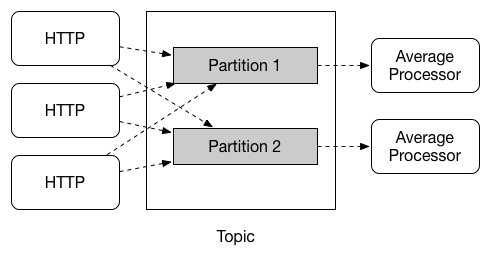

# 分区

Spring Cloud Stream支持在给定应用程序的多个实例之间划分数据。在分区场景中，物理通信介质（如broker topic）被视为结构化为多个分区。一个或多个生产者应用程序实例向多个消费者应用程序实例发送数据，并确保由共同特征标识的数据由同一消费者实例处理。

Spring Cloud Stream为以统一的方式实现分区处理用例提供了一个通用的抽象。因此，无论 broker 本身是否自然分区（例如Kafka是有分区的，而RabbitMQ是没有分区的），都可以使用分区。

分区是有状态处理中的一个关键概念，它对于确保所有相关数据一起处理至关重要（无论是出于性能还是一致性原因）。例如，在时间窗平均计算示例中，来自任何给定传感器的所有测量值都由同一应用实例处理是很重要的。

**注**：要设置分区处理场景，必须同时配置数据生成端和数据消费端。