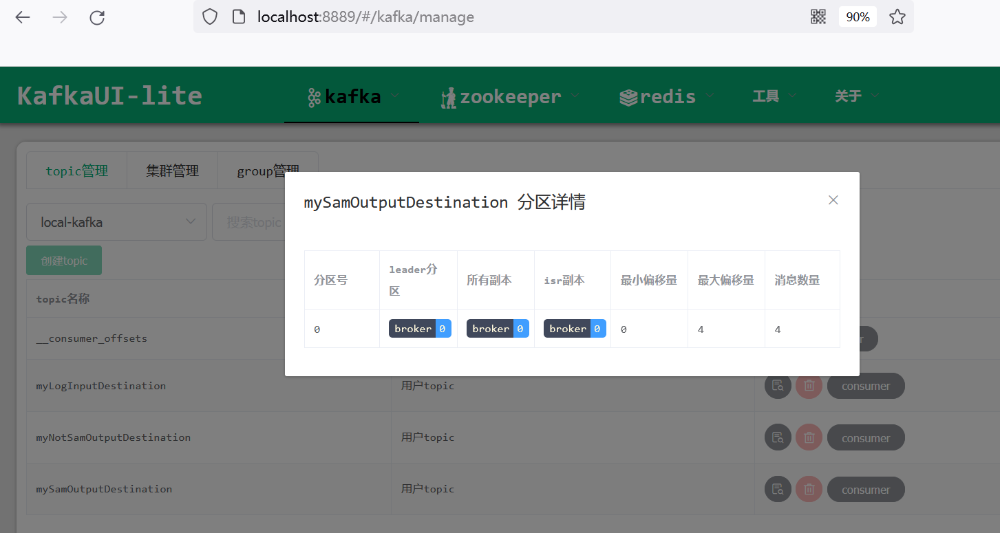
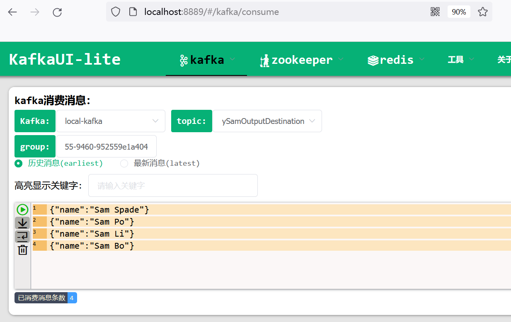

# 动态Destination示例


Spring Cloud Stream支持动态Destination（在Kafka里面就是动态Topic的概念），主要是通过StreamBridge来实现动态的发送消息到指定Destination。本例以Kafka binder为例，演示动态Destination的场景。


## 初始化应用


初始化应用，pom.xml中添加Kafka这个Binder：

```xml
<?xml version="1.0" encoding="UTF-8"?>
<project xmlns="http://maven.apache.org/POM/4.0.0" xmlns:xsi="http://www.w3.org/2001/XMLSchema-instance"
	xsi:schemaLocation="http://maven.apache.org/POM/4.0.0 https://maven.apache.org/xsd/maven-4.0.0.xsd">
	<modelVersion>4.0.0</modelVersion>
	<parent>
		<groupId>org.springframework.boot</groupId>
		<artifactId>spring-boot-starter-parent</artifactId>
		<version>3.0.2</version>
		<relativePath/> <!-- lookup parent from repository -->
	</parent>
	<groupId>com.waylau.sprint.cloud.stream.binder.kafka</groupId>
	<artifactId>spring-cloud-stream-dynamic-destination-kafka-demo</artifactId>
	<version>0.0.1-SNAPSHOT</version>
	<name>spring-cloud-stream-dynamic-destination-kafka-demo</name>
	<description>Dynamic Destination Demo for Spring Cloud Stream Kafka binder</description>
	<properties>
		<java.version>17</java.version>
		<spring-cloud.version>2022.0.1</spring-cloud.version>
	</properties>
	<dependencies>
		<dependency>
			<groupId>org.springframework.cloud</groupId>
			<artifactId>spring-cloud-stream</artifactId>
		</dependency>
		<dependency>
			<groupId>org.springframework.cloud</groupId>
			<artifactId>spring-cloud-stream-binder-kafka</artifactId>
		</dependency>
		<dependency>
			<groupId>org.springframework.kafka</groupId>
			<artifactId>spring-kafka</artifactId>
		</dependency>

		<dependency>
			<groupId>org.springframework.boot</groupId>
			<artifactId>spring-boot-starter-test</artifactId>
			<scope>test</scope>
		</dependency>
		<dependency>
			<groupId>org.springframework.cloud</groupId>
			<artifactId>spring-cloud-stream-test-binder</artifactId>
			<scope>test</scope>
		</dependency>
		<dependency>
			<groupId>org.springframework.kafka</groupId>
			<artifactId>spring-kafka-test</artifactId>
			<scope>test</scope>
		</dependency>
	</dependencies>
	<dependencyManagement>
		<dependencies>
			<dependency>
				<groupId>org.springframework.cloud</groupId>
				<artifactId>spring-cloud-dependencies</artifactId>
				<version>${spring-cloud.version}</version>
				<type>pom</type>
				<scope>import</scope>
			</dependency>
		</dependencies>
	</dependencyManagement>

	<build>
		<plugins>
			<plugin>
				<groupId>org.springframework.boot</groupId>
				<artifactId>spring-boot-maven-plugin</artifactId>
			</plugin>
		</plugins>
	</build>
	<repositories>
		<repository>
			<id>central</id>
			<name>aliyun maven</name>
			<url>http://maven.aliyun.com/nexus/content/groups/public/</url>
		</repository>
	</repositories>
</project>
```


## 添加消息处理器


在DemoApplication中添加如下消息处理器：


```java
package com.waylau.sprint.cloud.stream.binder.kafka.demo;

import org.springframework.beans.factory.annotation.Autowired;
import org.springframework.boot.SpringApplication;
import org.springframework.boot.autoconfigure.SpringBootApplication;
import org.springframework.context.annotation.Bean;

import java.util.function.Consumer;

// 导入StreamBridge
import org.springframework.cloud.stream.function.StreamBridge;

/**
 * 应用入口
 *
 * @author <a href="https://waylau.com">Way Lau</a>
 * @since 2023-02-20
 */
@SpringBootApplication
public class DemoApplication {
    @Autowired
    private StreamBridge streamBridge;

    public static void main(String[] args) {
        SpringApplication.run(DemoApplication.class, args);
    }

    /**
     * 消息处理器
     *
     * @return
     */
    @Bean
    public Consumer<Person> log() {
        return person -> {
            System.out.println("Received: " + person);

            String personName = person.getName();

            // 模拟业务场景，比如包含Sam的消息去到指定的Destination；否则发到另外的Destination
            if (personName.contains("Sam")) {
                // 通过StreamBridge发送到指定的Destination
                streamBridge.send("sam-out-0", person);
            } else {
                streamBridge.send("notSam-out-0", person);
            }

        };
    }

    public static class Person {
        private String name;

        public String getName() {
            return name;
        }

        public void setName(String name) {
            this.name = name;
        }

        public String toString() {
            return this.name;
        }
    }
}
```


如上述代码所示：

* 该示例是使用函数式编程模型，将单个消息处理程序定义为Consumer。
* 自动将传入的消息负载转换为Person类型。
* 在log()方法里面，使用了StreamBridge的send方法来动态发送接收到的消息转发到不同的Destination。方法里面模拟了业务功能：
  * 包含了“Sam”名字的人员，发送到了“sam-out-0”这个Destination；
  * 不包含“Sam”名字的人员，发送到了“notSam-out-0”这个Destination。


## 添加应用配置


在application.properties中添加如下配置：

```
# 一条输入binding配置
spring.cloud.stream.bindings.log-in-0.binder=kafka
spring.cloud.stream.bindings.log-in-0.destination=myLogInputDestination


# 两条输出bining配置
spring.cloud.stream.bindings.sam-out-0.binder=kafka
spring.cloud.stream.bindings.sam-out-0.destination=mySamOutputDestination
spring.cloud.stream.bindings.notSam-out-0.binder=kafka
spring.cloud.stream.bindings.notSam-out-0.destination=myNotSamOutputDestination

```

其中，log-in-0是一条输入binding，使用了Kafka binder。destination设置为了“myLogInputDestination”（也就是Kafka里面的Topic）。

sam-out-0和otSam-out-0是两条输出binding，也是使用了Kafka binder。destination分别设置为了“mySamOutputDestination”和“myNotSamOutputDestination”。


## 启动应用

```java
2023-02-20T15:30:50.218+08:00  INFO 18936 --- [           main] o.a.kafka.common.utils.AppInfoParser     : Kafka version: 3.3.2
2023-02-20T15:30:50.218+08:00  INFO 18936 --- [           main] o.a.kafka.common.utils.AppInfoParser     : Kafka commitId: b66af662e61082cb
2023-02-20T15:30:50.218+08:00  INFO 18936 --- [           main] o.a.kafka.common.utils.AppInfoParser     : Kafka startTimeMs: 1676878250218
2023-02-20T15:30:50.225+08:00  INFO 18936 --- [           main] org.apache.kafka.clients.Metadata        : [Consumer clientId=consumer-anonymous.130bac09-cbf6-4e55-9460-952559e1a404-1, groupId=anonymous.130bac09-cbf6-4e55-9460-952559e1a404] Cluster ID: Jcv68oerTDeFOdamU25VRQ
2023-02-20T15:30:50.225+08:00  INFO 18936 --- [           main] o.a.k.c.c.internals.ConsumerCoordinator  : [Consumer clientId=consumer-anonymous.130bac09-cbf6-4e55-9460-952559e1a404-1, groupId=anonymous.130bac09-cbf6-4e55-9460-952559e1a404] Resetting generation and member id due to: consumer pro-actively leaving the group
2023-02-20T15:30:50.225+08:00  INFO 18936 --- [           main] o.a.k.c.c.internals.ConsumerCoordinator  : [Consumer clientId=consumer-anonymous.130bac09-cbf6-4e55-9460-952559e1a404-1, groupId=anonymous.130bac09-cbf6-4e55-9460-952559e1a404] Request joining group due to: consumer pro-actively leaving the group
2023-02-20T15:30:50.226+08:00  INFO 18936 --- [           main] o.apache.kafka.common.metrics.Metrics    : Metrics scheduler closed
2023-02-20T15:30:50.226+08:00  INFO 18936 --- [           main] o.apache.kafka.common.metrics.Metrics    : Closing reporter org.apache.kafka.common.metrics.JmxReporter
2023-02-20T15:30:50.226+08:00  INFO 18936 --- [           main] o.apache.kafka.common.metrics.Metrics    : Metrics reporters closed
2023-02-20T15:30:50.227+08:00  INFO 18936 --- [           main] o.a.kafka.common.utils.AppInfoParser     : App info kafka.consumer for consumer-anonymous.130bac09-cbf6-4e55-9460-952559e1a404-1 unregistered
2023-02-20T15:30:50.251+08:00  INFO 18936 --- [           main] o.s.c.stream.binder.BinderErrorChannel   : Channel 'kafka-1715606187.log-in-0.errors' has 1 subscriber(s).
2023-02-20T15:30:50.269+08:00  INFO 18936 --- [           main] o.a.k.clients.consumer.ConsumerConfig    : ConsumerConfig values: 
	allow.auto.create.topics = true
	auto.commit.interval.ms = 100
	auto.offset.reset = latest
	bootstrap.servers = [localhost:9092]
	check.crcs = true
	client.dns.lookup = use_all_dns_ips
	client.id = consumer-anonymous.130bac09-cbf6-4e55-9460-952559e1a404-2
	client.rack = 
	connections.max.idle.ms = 540000
	default.api.timeout.ms = 60000
	enable.auto.commit = false
	exclude.internal.topics = true
	fetch.max.bytes = 52428800
	fetch.max.wait.ms = 500
	fetch.min.bytes = 1
	group.id = anonymous.130bac09-cbf6-4e55-9460-952559e1a404
	group.instance.id = null
	heartbeat.interval.ms = 3000
	interceptor.classes = []
	internal.leave.group.on.close = true
	internal.throw.on.fetch.stable.offset.unsupported = false
	isolation.level = read_uncommitted
	key.deserializer = class org.apache.kafka.common.serialization.ByteArrayDeserializer
	max.partition.fetch.bytes = 1048576
	max.poll.interval.ms = 300000
	max.poll.records = 500
	metadata.max.age.ms = 300000
	metric.reporters = []
	metrics.num.samples = 2
	metrics.recording.level = INFO
	metrics.sample.window.ms = 30000
	partition.assignment.strategy = [class org.apache.kafka.clients.consumer.RangeAssignor, class org.apache.kafka.clients.consumer.CooperativeStickyAssignor]
	receive.buffer.bytes = 65536
	reconnect.backoff.max.ms = 1000
	reconnect.backoff.ms = 50
	request.timeout.ms = 30000
	retry.backoff.ms = 100
	sasl.client.callback.handler.class = null
	sasl.jaas.config = null
	sasl.kerberos.kinit.cmd = /usr/bin/kinit
	sasl.kerberos.min.time.before.relogin = 60000
	sasl.kerberos.service.name = null
	sasl.kerberos.ticket.renew.jitter = 0.05
	sasl.kerberos.ticket.renew.window.factor = 0.8
	sasl.login.callback.handler.class = null
	sasl.login.class = null
	sasl.login.connect.timeout.ms = null
	sasl.login.read.timeout.ms = null
	sasl.login.refresh.buffer.seconds = 300
	sasl.login.refresh.min.period.seconds = 60
	sasl.login.refresh.window.factor = 0.8
	sasl.login.refresh.window.jitter = 0.05
	sasl.login.retry.backoff.max.ms = 10000
	sasl.login.retry.backoff.ms = 100
	sasl.mechanism = GSSAPI
	sasl.oauthbearer.clock.skew.seconds = 30
	sasl.oauthbearer.expected.audience = null
	sasl.oauthbearer.expected.issuer = null
	sasl.oauthbearer.jwks.endpoint.refresh.ms = 3600000
	sasl.oauthbearer.jwks.endpoint.retry.backoff.max.ms = 10000
	sasl.oauthbearer.jwks.endpoint.retry.backoff.ms = 100
	sasl.oauthbearer.jwks.endpoint.url = null
	sasl.oauthbearer.scope.claim.name = scope
	sasl.oauthbearer.sub.claim.name = sub
	sasl.oauthbearer.token.endpoint.url = null
	security.protocol = PLAINTEXT
	security.providers = null
	send.buffer.bytes = 131072
	session.timeout.ms = 45000
	socket.connection.setup.timeout.max.ms = 30000
	socket.connection.setup.timeout.ms = 10000
	ssl.cipher.suites = null
	ssl.enabled.protocols = [TLSv1.2, TLSv1.3]
	ssl.endpoint.identification.algorithm = https
	ssl.engine.factory.class = null
	ssl.key.password = null
	ssl.keymanager.algorithm = SunX509
	ssl.keystore.certificate.chain = null
	ssl.keystore.key = null
	ssl.keystore.location = null
	ssl.keystore.password = null
	ssl.keystore.type = JKS
	ssl.protocol = TLSv1.3
	ssl.provider = null
	ssl.secure.random.implementation = null
	ssl.trustmanager.algorithm = PKIX
	ssl.truststore.certificates = null
	ssl.truststore.location = null
	ssl.truststore.password = null
	ssl.truststore.type = JKS
	value.deserializer = class org.apache.kafka.common.serialization.ByteArrayDeserializer

2023-02-20T15:30:50.273+08:00  INFO 18936 --- [           main] o.a.kafka.common.utils.AppInfoParser     : Kafka version: 3.3.2
2023-02-20T15:30:50.273+08:00  INFO 18936 --- [           main] o.a.kafka.common.utils.AppInfoParser     : Kafka commitId: b66af662e61082cb
2023-02-20T15:30:50.273+08:00  INFO 18936 --- [           main] o.a.kafka.common.utils.AppInfoParser     : Kafka startTimeMs: 1676878250273
2023-02-20T15:30:50.274+08:00  INFO 18936 --- [           main] o.a.k.clients.consumer.KafkaConsumer     : [Consumer clientId=consumer-anonymous.130bac09-cbf6-4e55-9460-952559e1a404-2, groupId=anonymous.130bac09-cbf6-4e55-9460-952559e1a404] Subscribed to topic(s): myLogInputDestination
2023-02-20T15:30:50.276+08:00  INFO 18936 --- [           main] s.i.k.i.KafkaMessageDrivenChannelAdapter : started org.springframework.integration.kafka.inbound.KafkaMessageDrivenChannelAdapter@2a8a3ada
2023-02-20T15:30:50.282+08:00  INFO 18936 --- [           main] c.w.s.c.s.b.kafka.demo.DemoApplication   : Started DemoApplication in 2.409 seconds (process running for 2.683)
2023-02-20T15:30:50.283+08:00  INFO 18936 --- [container-0-C-1] org.apache.kafka.clients.Metadata        : [Consumer clientId=consumer-anonymous.130bac09-cbf6-4e55-9460-952559e1a404-2, groupId=anonymous.130bac09-cbf6-4e55-9460-952559e1a404] Resetting the last seen epoch of partition myLogInputDestination-0 to 0 since the associated topicId changed from null to nD7DJ1GBTc-Dcj70lgZnrw
2023-02-20T15:30:50.284+08:00  INFO 18936 --- [container-0-C-1] org.apache.kafka.clients.Metadata        : [Consumer clientId=consumer-anonymous.130bac09-cbf6-4e55-9460-952559e1a404-2, groupId=anonymous.130bac09-cbf6-4e55-9460-952559e1a404] Cluster ID: Jcv68oerTDeFOdamU25VRQ
2023-02-20T15:30:50.284+08:00  INFO 18936 --- [container-0-C-1] o.a.k.c.c.internals.ConsumerCoordinator  : [Consumer clientId=consumer-anonymous.130bac09-cbf6-4e55-9460-952559e1a404-2, groupId=anonymous.130bac09-cbf6-4e55-9460-952559e1a404] Discovered group coordinator waylau-lg:9092 (id: 2147483647 rack: null)
2023-02-20T15:30:50.286+08:00  INFO 18936 --- [container-0-C-1] o.a.k.c.c.internals.ConsumerCoordinator  : [Consumer clientId=consumer-anonymous.130bac09-cbf6-4e55-9460-952559e1a404-2, groupId=anonymous.130bac09-cbf6-4e55-9460-952559e1a404] (Re-)joining group
2023-02-20T15:30:50.296+08:00  INFO 18936 --- [container-0-C-1] o.a.k.c.c.internals.ConsumerCoordinator  : [Consumer clientId=consumer-anonymous.130bac09-cbf6-4e55-9460-952559e1a404-2, groupId=anonymous.130bac09-cbf6-4e55-9460-952559e1a404] Request joining group due to: need to re-join with the given member-id: consumer-anonymous.130bac09-cbf6-4e55-9460-952559e1a404-2-03bb1695-e19b-4990-ab27-789d67772e45
2023-02-20T15:30:50.297+08:00  INFO 18936 --- [container-0-C-1] o.a.k.c.c.internals.ConsumerCoordinator  : [Consumer clientId=consumer-anonymous.130bac09-cbf6-4e55-9460-952559e1a404-2, groupId=anonymous.130bac09-cbf6-4e55-9460-952559e1a404] Request joining group due to: rebalance failed due to 'The group member needs to have a valid member id before actually entering a consumer group.' (MemberIdRequiredException)
2023-02-20T15:30:50.297+08:00  INFO 18936 --- [container-0-C-1] o.a.k.c.c.internals.ConsumerCoordinator  : [Consumer clientId=consumer-anonymous.130bac09-cbf6-4e55-9460-952559e1a404-2, groupId=anonymous.130bac09-cbf6-4e55-9460-952559e1a404] (Re-)joining group
2023-02-20T15:30:50.299+08:00  INFO 18936 --- [container-0-C-1] o.a.k.c.c.internals.ConsumerCoordinator  : [Consumer clientId=consumer-anonymous.130bac09-cbf6-4e55-9460-952559e1a404-2, groupId=anonymous.130bac09-cbf6-4e55-9460-952559e1a404] Successfully joined group with generation Generation{generationId=1, memberId='consumer-anonymous.130bac09-cbf6-4e55-9460-952559e1a404-2-03bb1695-e19b-4990-ab27-789d67772e45', protocol='range'}
2023-02-20T15:30:50.301+08:00  INFO 18936 --- [container-0-C-1] o.a.k.c.c.internals.ConsumerCoordinator  : [Consumer clientId=consumer-anonymous.130bac09-cbf6-4e55-9460-952559e1a404-2, groupId=anonymous.130bac09-cbf6-4e55-9460-952559e1a404] Finished assignment for group at generation 1: {consumer-anonymous.130bac09-cbf6-4e55-9460-952559e1a404-2-03bb1695-e19b-4990-ab27-789d67772e45=Assignment(partitions=[myLogInputDestination-0])}
2023-02-20T15:30:50.308+08:00  INFO 18936 --- [container-0-C-1] o.a.k.c.c.internals.ConsumerCoordinator  : [Consumer clientId=consumer-anonymous.130bac09-cbf6-4e55-9460-952559e1a404-2, groupId=anonymous.130bac09-cbf6-4e55-9460-952559e1a404] Successfully synced group in generation Generation{generationId=1, memberId='consumer-anonymous.130bac09-cbf6-4e55-9460-952559e1a404-2-03bb1695-e19b-4990-ab27-789d67772e45', protocol='range'}
2023-02-20T15:30:50.308+08:00  INFO 18936 --- [container-0-C-1] o.a.k.c.c.internals.ConsumerCoordinator  : [Consumer clientId=consumer-anonymous.130bac09-cbf6-4e55-9460-952559e1a404-2, groupId=anonymous.130bac09-cbf6-4e55-9460-952559e1a404] Notifying assignor about the new Assignment(partitions=[myLogInputDestination-0])
2023-02-20T15:30:50.310+08:00  INFO 18936 --- [container-0-C-1] o.a.k.c.c.internals.ConsumerCoordinator  : [Consumer clientId=consumer-anonymous.130bac09-cbf6-4e55-9460-952559e1a404-2, groupId=anonymous.130bac09-cbf6-4e55-9460-952559e1a404] Adding newly assigned partitions: myLogInputDestination-0
2023-02-20T15:30:50.314+08:00  INFO 18936 --- [container-0-C-1] o.a.k.c.c.internals.ConsumerCoordinator  : [Consumer clientId=consumer-anonymous.130bac09-cbf6-4e55-9460-952559e1a404-2, groupId=anonymous.130bac09-cbf6-4e55-9460-952559e1a404] Found no committed offset for partition myLogInputDestination-0
2023-02-20T15:30:50.318+08:00  INFO 18936 --- [container-0-C-1] o.a.k.c.c.internals.ConsumerCoordinator  : [Consumer clientId=consumer-anonymous.130bac09-cbf6-4e55-9460-952559e1a404-2, groupId=anonymous.130bac09-cbf6-4e55-9460-952559e1a404] Found no committed offset for partition myLogInputDestination-0
2023-02-20T15:30:50.325+08:00  INFO 18936 --- [container-0-C-1] o.a.k.c.c.internals.SubscriptionState    : [Consumer clientId=consumer-anonymous.130bac09-cbf6-4e55-9460-952559e1a404-2, groupId=anonymous.130bac09-cbf6-4e55-9460-952559e1a404] Resetting offset for partition myLogInputDestination-0 to position FetchPosition{offset=0, offsetEpoch=Optional.empty, currentLeader=LeaderAndEpoch{leader=Optional[waylau-lg:9092 (id: 0 rack: null)], epoch=0}}.
2023-02-20T15:30:50.329+08:00  INFO 18936 --- [container-0-C-1] o.s.c.s.b.k.KafkaMessageChannelBinder$2  : anonymous.130bac09-cbf6-4e55-9460-952559e1a404: partitions assigned: [myLogInputDestination-0]
```

对应于Kafka里面的概念，myLogInputDestination就是topic名称，anonymous.130bac09-cbf6-4e55-9460-952559e1a404就说组名，myLogInputDestination-0就是分区名。


## 测试发送和接收

Kafka的管理平台，分别测试发送以下消息：

```
{"name":"Sam Spade"}

{"name":"Sam Po"}

{"name":"Sam Li"}

{"name":"Sam Bo"}

{"name":"Way Lau"}

{"name":"Fei Po"}

{"name":"Gu Li"}
```


因此，应用也相应的收到了这些消息。

```
Received: Sam Spade
Received: Sam Po
Received: Sam Li
Received: Sam Bo
Received: Way Lau
Received: Fei Po
Received: Gu Li
```

收到消息后，应用后转到指定的Destination。理论上，应用会讲前4条消息和后3条消息分别发到不同的Destination。

为了验证是否按照预期发送了Destination，我们通过Kafka的管理平台观察各个Destination里面的消息数据。


mySamOutputDestination 分区接收到了4条信息





消息内容如下：





myNotSamOutputDestination 分区接收到了3条信息


消息内容如下：


## 源码

本节示例见`spring-cloud-stream-dynamic-destination-kafka-demo`。


