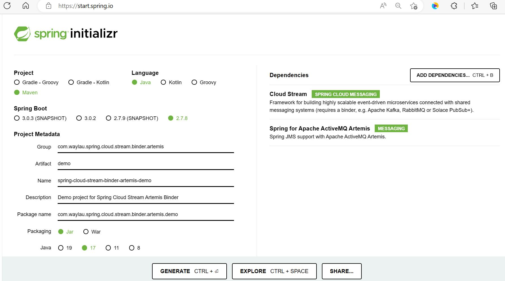
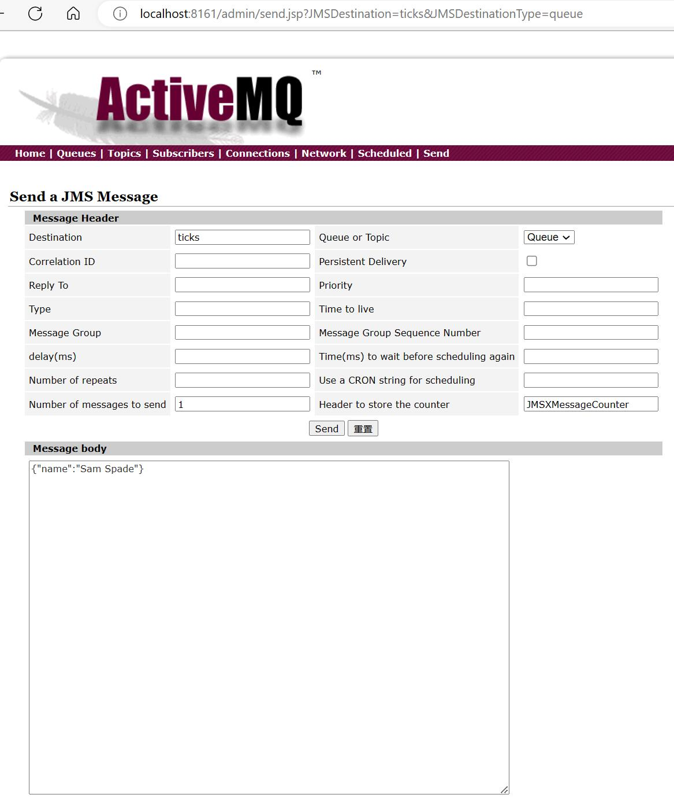

# Spring Cloud Stream Artemis binder示例


## 初始化应用


通过[Spring Initializr](https://start.spring.io/)来初始化Spring Cloud Stream应用。




这里我们选用的Spring Boot的版本为2.7.8，这是因为目前本文所选用的Spring Cloud Stream Artemis binder组件暂不支持Spring Boot 3.x版本。

应用的依赖主要是两部分，一个是Spring Cloud Stream，另外一个是具体的MQ产品：

* Cloud Stream
* Spring for Apache ActiveMQ Artemis


点击“Generate Project”来生成应用原型。


## 添加Spring Cloud Stream JMS binder

目前，Spring Cloud Stream并不支持JSM以及ActiveMQ，因此，本文所选用的Spring Cloud Stream JMS binder来自个人开源项目（<https://github.com/mohammedamineboutouil/spring-cloud-stream-binder-jms>）。

在应用的pom.xml文件中添加如下依赖：

```xml
<spring-cloud-stream-binder-jms.version>1.0.0.RELEASE</spring-cloud-stream-binder-jms.version>

<!--start: 添加binder-->
<dependency>
  <groupId>com.boutouil</groupId>
  <artifactId>spring-cloud-stream-binder-jms</artifactId>
  <version>${spring-cloud-stream-binder-jms.version}</version>
</dependency>
<!--end: 添加binder-->
```

最终，应用的完整pom.xml文件如下：

```xml
<?xml version="1.0" encoding="UTF-8"?>
<project xmlns="http://maven.apache.org/POM/4.0.0" xmlns:xsi="http://www.w3.org/2001/XMLSchema-instance"
	xsi:schemaLocation="http://maven.apache.org/POM/4.0.0 https://maven.apache.org/xsd/maven-4.0.0.xsd">
	<modelVersion>4.0.0</modelVersion>
	<parent>
		<groupId>org.springframework.boot</groupId>
		<artifactId>spring-boot-starter-parent</artifactId>
		<version>2.7.8</version>
		<relativePath/> <!-- lookup parent from repository -->
	</parent>
	<groupId>com.waylau.spring.cloud.stream.binder.jms</groupId>
	<artifactId>spring-cloud-stream-binder-jms-demo</artifactId>
	<version>0.0.1-SNAPSHOT</version>
	<name>spring-cloud-stream-binder-jms-demo</name>
	<description>Demo project for Spring Cloud Stream JMS binder</description>
	<properties>
		<java.version>17</java.version>
		<spring-cloud.version>2021.0.5</spring-cloud.version>
		<spring-cloud-stream-binder-jms.version>1.0.0.RELEASE</spring-cloud-stream-binder-jms.version>
	</properties>
	<dependencies>
		<dependency>
			<groupId>org.springframework.boot</groupId>
			<artifactId>spring-boot-starter-activemq</artifactId>
		</dependency>
		<dependency>
			<groupId>org.springframework.cloud</groupId>
			<artifactId>spring-cloud-stream</artifactId>
		</dependency>

		<!--start: 添加binder-->
		<dependency>
			<groupId>com.boutouil</groupId>
			<artifactId>spring-cloud-stream-binder-jms</artifactId>
			<version>${spring-cloud-stream-binder-jms.version}</version>
		</dependency>
		<!--end: 添加binder-->

		<dependency>
			<groupId>org.springframework.boot</groupId>
			<artifactId>spring-boot-starter-test</artifactId>
			<scope>test</scope>
		</dependency>
		<dependency>
			<groupId>org.springframework.cloud</groupId>
			<artifactId>spring-cloud-stream</artifactId>
			<scope>test</scope>
			<classifier>test-binder</classifier>
			<type>test-jar</type>
		</dependency>
	</dependencies>
	<dependencyManagement>
		<dependencies>
			<dependency>
				<groupId>org.springframework.cloud</groupId>
				<artifactId>spring-cloud-dependencies</artifactId>
				<version>${spring-cloud.version}</version>
				<type>pom</type>
				<scope>import</scope>
			</dependency>
		</dependencies>
	</dependencyManagement>

	<build>
		<plugins>
			<plugin>
				<groupId>org.springframework.boot</groupId>
				<artifactId>spring-boot-maven-plugin</artifactId>
			</plugin>
		</plugins>
	</build>

</project>
```


## 添加消息处理器


在DemoApplication中添加如下消息处理器：


```java
import org.springframework.boot.SpringApplication;
import org.springframework.boot.autoconfigure.SpringBootApplication;
import org.springframework.context.annotation.Bean;

import java.util.function.Consumer;

/**
 * 应用入口
 *
 * @author <a href="https://waylau.com">Way Lau</a>
 * @since 2023-02-15
 */
@SpringBootApplication
public class DemoApplication {

    public static void main(String[] args) {
        SpringApplication.run(DemoApplication.class, args);
    }

	/**
	 * 消息处理器
	 * @return
	 */
    @Bean
    public Consumer<Person> log() {
        return person -> {
            System.out.println("Received: " + person);
        };
    }

    public static class Person {
        private String name;

        public String getName() {
            return name;
        }

        public void setName(String name) {
            this.name = name;
        }

        public String toString() {
            return this.name;
        }
    }
}
```


## 添加应用配置


在application.properties中添加如下配置：

```
# 是否基于内存的ActiveMQ
spring.activemq.in-memory=false

# 必须设置destination
spring.cloud.stream.bindings.log-in-0.destination=queue://ticks
spring.cloud.stream.bindings.log-in-0.dlq.destination=queue://ticks
```

这个配置是可选的，如果不配置，则会默认使用基于内存的ActiveMQ。本文因为有独立搭建的ActiveMQ，因此设置值为false。

第2、3条配置是用于配置destination，是必选项。其中配置值“queue://ticks”前半部分是用于指示消息的模式是queue还是topic，后半部是对应queue或是topic的名称。本例，自定义了一个名为“ticks”的queue。


如上述代码所示：

* 该示例是使用函数式编程模型，将单个消息处理程序定义为Consumer。
* 自动将传入的消息负载转换为Person类型。


## 启动应用

先启动ActiveMQ服务器，而后启动应用，控制台输出如下内容，则证明启动成功：

```
2023-02-15 16:00:16.682  INFO 3304 --- [           main] c.w.s.c.s.b.jms.demo.DemoApplication     : Starting DemoApplication using Java 19.0.2 on waylau-lg with PID 3304 (D:\workspace\github\spring-cloud-stream-tutorial\samples\spring-cloud-stream-binder-jms-demo\target\classes started by wayla in D:\workspace\github\spring-cloud-stream-tutorial\samples\spring-cloud-stream-binder-jms-demo)
2023-02-15 16:00:16.685  INFO 3304 --- [           main] c.w.s.c.s.b.jms.demo.DemoApplication     : No active profile set, falling back to 1 default profile: "default"
2023-02-15 16:00:17.017  INFO 3304 --- [           main] faultConfiguringBeanFactoryPostProcessor : No bean named 'errorChannel' has been explicitly defined. Therefore, a default PublishSubscribeChannel will be created.
2023-02-15 16:00:17.027  INFO 3304 --- [           main] faultConfiguringBeanFactoryPostProcessor : No bean named 'integrationHeaderChannelRegistry' has been explicitly defined. Therefore, a default DefaultHeaderChannelRegistry will be created.
2023-02-15 16:00:17.603  INFO 3304 --- [           main] o.s.c.s.m.DirectWithAttributesChannel    : Channel 'application.log-in-0' has 1 subscriber(s).
2023-02-15 16:00:17.681  INFO 3304 --- [           main] o.s.i.endpoint.EventDrivenConsumer       : Adding {logging-channel-adapter:_org.springframework.integration.errorLogger} as a subscriber to the 'errorChannel' channel
2023-02-15 16:00:17.682  INFO 3304 --- [           main] o.s.i.channel.PublishSubscribeChannel    : Channel 'application.errorChannel' has 1 subscriber(s).
2023-02-15 16:00:17.682  INFO 3304 --- [           main] o.s.i.endpoint.EventDrivenConsumer       : started bean '_org.springframework.integration.errorLogger'
2023-02-15 16:00:17.983  INFO 3304 --- [           main] c.b.binder.jms.provision.JmsProvisioner  : Provisioned: queue://ticks
2023-02-15 16:00:17.984  INFO 3304 --- [           main] c.b.binder.jms.provision.JmsProvisioner  : Provisioned: queue://ticks.dlq
2023-02-15 16:00:17.988  INFO 3304 --- [           main] o.s.c.stream.binder.BinderErrorChannel   : Channel 'ticks.null.errors' has 1 subscriber(s).
2023-02-15 16:00:17.990  INFO 3304 --- [           main] o.s.c.stream.binder.BinderErrorChannel   : Channel 'ticks.null.errors' has 2 subscriber(s).
2023-02-15 16:00:17.995  INFO 3304 --- [           main] c.b.b.j.m.h.JmsInboundChannelAdapter     : started bean 'inbound.ticks.null'
2023-02-15 16:00:17.999  INFO 3304 --- [           main] c.w.s.c.s.b.jms.demo.DemoApplication     : Started DemoApplication in 1.578 seconds (JVM running for 1.82)
```


## 发送消息与接收


可以通过<http://localhost:8161/admin/>来访问ActiveMQ的控制台界面。也可以作为测试工具，用于消息的发送。


在ActiveMQ的控制台界面发送以下JSON消息到queue “ticks”。


```json
{"name":"Sam Spade"}
```




此时应用就能收到这条消息。

```
Received: Sam Spade
```


## 源码

本节示例见`spring-cloud-stream-binder-jms-demo`。