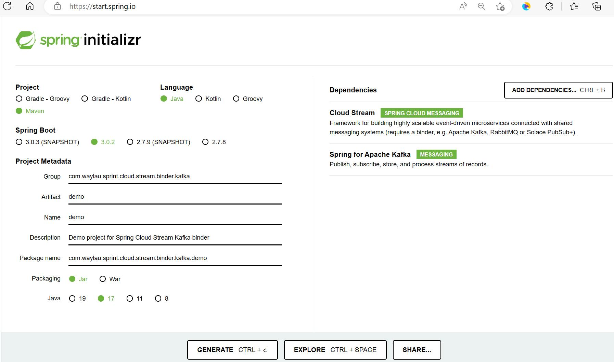
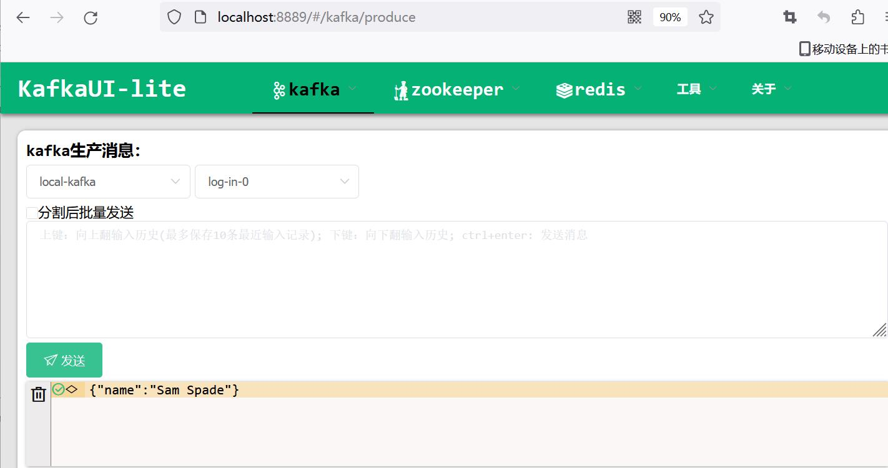

# Spring Cloud Stream Kafka binder示例

## 初始化应用

通过[Spring Initializr](https://start.spring.io/)来初始化Spring Cloud Stream应用。



应用的依赖主要是两部分，一个是Spring Cloud Stream，另外一个是具体的MQ产品：

* Cloud Stream
* Spring for Apache Kafka


点击“Generate Project”来生成应用原型。

应用的pom.xml文件如下：

```xml
<?xml version="1.0" encoding="UTF-8"?>
<project xmlns="http://maven.apache.org/POM/4.0.0" xmlns:xsi="http://www.w3.org/2001/XMLSchema-instance"
	xsi:schemaLocation="http://maven.apache.org/POM/4.0.0 https://maven.apache.org/xsd/maven-4.0.0.xsd">
	<modelVersion>4.0.0</modelVersion>
	<parent>
		<groupId>org.springframework.boot</groupId>
		<artifactId>spring-boot-starter-parent</artifactId>
		<version>3.0.2</version>
		<relativePath/> <!-- lookup parent from repository -->
	</parent>
	<groupId>com.waylau.sprint.cloud.stream.binder.kafka</groupId>
	<artifactId>spring-cloud-stream-binder-kafka-demo</artifactId>
	<version>0.0.1-SNAPSHOT</version>
	<name>spring-cloud-stream-binder-kafka-demo</name>
	<description>Demo project for Spring Cloud Stream Kafka binder</description>
	<properties>
		<java.version>17</java.version>
		<spring-cloud.version>2022.0.1</spring-cloud.version>
	</properties>
	<dependencies>
		<dependency>
			<groupId>org.springframework.cloud</groupId>
			<artifactId>spring-cloud-stream</artifactId>
		</dependency>
		<dependency>
			<groupId>org.springframework.cloud</groupId>
			<artifactId>spring-cloud-stream-binder-kafka</artifactId>
		</dependency>
		<dependency>
			<groupId>org.springframework.kafka</groupId>
			<artifactId>spring-kafka</artifactId>
		</dependency>

		<dependency>
			<groupId>org.springframework.boot</groupId>
			<artifactId>spring-boot-starter-test</artifactId>
			<scope>test</scope>
		</dependency>
		<dependency>
			<groupId>org.springframework.cloud</groupId>
			<artifactId>spring-cloud-stream-test-binder</artifactId>
			<scope>test</scope>
		</dependency>
		<dependency>
			<groupId>org.springframework.kafka</groupId>
			<artifactId>spring-kafka-test</artifactId>
			<scope>test</scope>
		</dependency>
	</dependencies>
	<dependencyManagement>
		<dependencies>
			<dependency>
				<groupId>org.springframework.cloud</groupId>
				<artifactId>spring-cloud-dependencies</artifactId>
				<version>${spring-cloud.version}</version>
				<type>pom</type>
				<scope>import</scope>
			</dependency>
		</dependencies>
	</dependencyManagement>

	<build>
		<plugins>
			<plugin>
				<groupId>org.springframework.boot</groupId>
				<artifactId>spring-boot-maven-plugin</artifactId>
			</plugin>
		</plugins>
	</build>

</project>
```


## 添加消息处理器


在DemoApplication中添加如下消息处理器：


```java
import org.springframework.boot.SpringApplication;
import org.springframework.boot.autoconfigure.SpringBootApplication;
import org.springframework.context.annotation.Bean;

import java.util.function.Consumer;

/**
 * 应用入口
 *
 * @author <a href="https://waylau.com">Way Lau</a>
 * @since 2023-02-16
 */
@SpringBootApplication
public class DemoApplication {

    public static void main(String[] args) {
        SpringApplication.run(DemoApplication.class, args);
    }

	/**
	 * 消息处理器
	 * @return
	 */
    @Bean
    public Consumer<Person> log() {
        return person -> {
            System.out.println("Received: " + person);
        };
    }

    public static class Person {
        private String name;

        public String getName() {
            return name;
        }

        public void setName(String name) {
            this.name = name;
        }

        public String toString() {
            return this.name;
        }
    }
}
```


如上述代码所示：

* 该示例是使用函数式编程模型，将单个消息处理程序定义为Consumer。
* 自动将传入的消息负载转换为Person类型。


## 启动应用

启动应用控制台输出如下内容，则证明启动成功：

```
D:\dev\java\openjdk-19.0.2_windows-x64_bin\jdk-19.0.2\bin\java.exe -javaagent:D:\dev\java\ideaIC-2022.3.1.win\lib\idea_rt.jar=6582:D:\dev\java\ideaIC-2022.3.1.win\bin -Dfile.encoding=UTF-8 -Dsun.stdout.encoding=UTF-8 -Dsun.stderr.encoding=UTF-8 -classpath D:\workspace\github\spring-cloud-stream-tutorial\samples\spring-cloud-stream-binder-kafka-demo\target\classes;D:\data\maven\org\springframework\cloud\spring-cloud-stream\4.0.1\spring-cloud-stream-4.0.1.jar;D:\data\maven\org\springframework\boot\spring-boot-starter-validation\3.0.2\spring-boot-starter-validation-3.0.2.jar;D:\data\maven\org\apache\tomcat\embed\tomcat-embed-el\10.1.5\tomcat-embed-el-10.1.5.jar;D:\data\maven\org\hibernate\validator\hibernate-validator\8.0.0.Final\hibernate-validator-8.0.0.Final.jar;D:\data\maven\jakarta\validation\jakarta.validation-api\3.0.2\jakarta.validation-api-3.0.2.jar;D:\data\maven\org\jboss\logging\jboss-logging\3.5.0.Final\jboss-logging-3.5.0.Final.jar;D:\data\maven\com\fasterxml\classmate\1.5.1\classmate-1.5.1.jar;D:\data\maven\org\springframework\spring-messaging\6.0.4\spring-messaging-6.0.4.jar;D:\data\maven\org\springframework\spring-beans\6.0.4\spring-beans-6.0.4.jar;D:\data\maven\org\springframework\integration\spring-integration-core\6.0.2\spring-integration-core-6.0.2.jar;D:\data\maven\org\springframework\spring-aop\6.0.4\spring-aop-6.0.4.jar;D:\data\maven\io\projectreactor\reactor-core\3.5.2\reactor-core-3.5.2.jar;D:\data\maven\org\reactivestreams\reactive-streams\1.0.4\reactive-streams-1.0.4.jar;D:\data\maven\org\springframework\integration\spring-integration-jmx\6.0.2\spring-integration-jmx-6.0.2.jar;D:\data\maven\org\springframework\retry\spring-retry\2.0.0\spring-retry-2.0.0.jar;D:\data\maven\org\springframework\cloud\spring-cloud-function-context\4.0.1\spring-cloud-function-context-4.0.1.jar;D:\data\maven\net\jodah\typetools\0.6.2\typetools-0.6.2.jar;D:\data\maven\org\springframework\boot\spring-boot-autoconfigure\3.0.2\spring-boot-autoconfigure-3.0.2.jar;D:\data\maven\org\springframework\cloud\spring-cloud-function-core\4.0.1\spring-cloud-function-core-4.0.1.jar;D:\data\maven\javax\annotation\javax.annotation-api\1.3.2\javax.annotation-api-1.3.2.jar;D:\data\maven\javax\activation\javax.activation-api\1.2.0\javax.activation-api-1.2.0.jar;D:\data\maven\com\fasterxml\jackson\core\jackson-databind\2.14.1\jackson-databind-2.14.1.jar;D:\data\maven\com\fasterxml\jackson\core\jackson-annotations\2.14.1\jackson-annotations-2.14.1.jar;D:\data\maven\com\fasterxml\jackson\core\jackson-core\2.14.1\jackson-core-2.14.1.jar;D:\data\maven\org\jetbrains\kotlin\kotlin-stdlib-jdk8\1.7.22\kotlin-stdlib-jdk8-1.7.22.jar;D:\data\maven\org\jetbrains\kotlin\kotlin-stdlib\1.7.22\kotlin-stdlib-1.7.22.jar;D:\data\maven\org\jetbrains\kotlin\kotlin-stdlib-common\1.7.22\kotlin-stdlib-common-1.7.22.jar;D:\data\maven\org\jetbrains\annotations\13.0\annotations-13.0.jar;D:\data\maven\org\jetbrains\kotlin\kotlin-stdlib-jdk7\1.7.22\kotlin-stdlib-jdk7-1.7.22.jar;D:\data\maven\org\springframework\cloud\spring-cloud-stream-binder-kafka\4.0.1\spring-cloud-stream-binder-kafka-4.0.1.jar;D:\data\maven\org\springframework\cloud\spring-cloud-stream-binder-kafka-core\4.0.1\spring-cloud-stream-binder-kafka-core-4.0.1.jar;D:\data\maven\org\springframework\integration\spring-integration-kafka\6.0.2\spring-integration-kafka-6.0.2.jar;D:\data\maven\org\springframework\kafka\spring-kafka\3.0.2\spring-kafka-3.0.2.jar;D:\data\maven\org\springframework\spring-context\6.0.4\spring-context-6.0.4.jar;D:\data\maven\org\springframework\spring-expression\6.0.4\spring-expression-6.0.4.jar;D:\data\maven\org\springframework\spring-tx\6.0.4\spring-tx-6.0.4.jar;D:\data\maven\org\apache\kafka\kafka-clients\3.3.2\kafka-clients-3.3.2.jar;D:\data\maven\com\github\luben\zstd-jni\1.5.2-1\zstd-jni-1.5.2-1.jar;D:\data\maven\org\lz4\lz4-java\1.8.0\lz4-java-1.8.0.jar;D:\data\maven\org\xerial\snappy\snappy-java\1.1.8.4\snappy-java-1.1.8.4.jar;D:\data\maven\org\slf4j\slf4j-api\2.0.6\slf4j-api-2.0.6.jar;D:\data\maven\io\micrometer\micrometer-observation\1.10.3\micrometer-observation-1.10.3.jar;D:\data\maven\io\micrometer\micrometer-commons\1.10.3\micrometer-commons-1.10.3.jar;D:\data\maven\com\google\code\findbugs\jsr305\3.0.2\jsr305-3.0.2.jar;D:\data\maven\org\springframework\boot\spring-boot-starter\3.0.2\spring-boot-starter-3.0.2.jar;D:\data\maven\org\springframework\boot\spring-boot\3.0.2\spring-boot-3.0.2.jar;D:\data\maven\org\springframework\boot\spring-boot-starter-logging\3.0.2\spring-boot-starter-logging-3.0.2.jar;D:\data\maven\ch\qos\logback\logback-classic\1.4.5\logback-classic-1.4.5.jar;D:\data\maven\ch\qos\logback\logback-core\1.4.5\logback-core-1.4.5.jar;D:\data\maven\org\apache\logging\log4j\log4j-to-slf4j\2.19.0\log4j-to-slf4j-2.19.0.jar;D:\data\maven\org\apache\logging\log4j\log4j-api\2.19.0\log4j-api-2.19.0.jar;D:\data\maven\org\slf4j\jul-to-slf4j\2.0.6\jul-to-slf4j-2.0.6.jar;D:\data\maven\jakarta\annotation\jakarta.annotation-api\2.1.1\jakarta.annotation-api-2.1.1.jar;D:\data\maven\org\yaml\snakeyaml\1.33\snakeyaml-1.33.jar;D:\data\maven\org\springframework\spring-core\6.0.4\spring-core-6.0.4.jar;D:\data\maven\org\springframework\spring-jcl\6.0.4\spring-jcl-6.0.4.jar com.waylau.sprint.cloud.stream.binder.kafka.demo.DemoApplication

  .   ____          _            __ _ _
 /\\ / ___'_ __ _ _(_)_ __  __ _ \ \ \ \
( ( )\___ | '_ | '_| | '_ \/ _` | \ \ \ \
 \\/  ___)| |_)| | | | | || (_| |  ) ) ) )
  '  |____| .__|_| |_|_| |_\__, | / / / /
 =========|_|==============|___/=/_/_/_/
 :: Spring Boot ::                (v3.0.2)

2023-02-16T15:36:36.330+08:00  INFO 4416 --- [           main] c.w.s.c.s.b.kafka.demo.DemoApplication   : Starting DemoApplication using Java 19.0.2 with PID 4416 (D:\workspace\github\spring-cloud-stream-tutorial\samples\spring-cloud-stream-binder-kafka-demo\target\classes started by wayla in D:\workspace\github\spring-cloud-stream-tutorial\samples\spring-cloud-stream-binder-kafka-demo)
2023-02-16T15:36:36.332+08:00  INFO 4416 --- [           main] c.w.s.c.s.b.kafka.demo.DemoApplication   : No active profile set, falling back to 1 default profile: "default"
2023-02-16T15:36:36.767+08:00  INFO 4416 --- [           main] faultConfiguringBeanFactoryPostProcessor : No bean named 'errorChannel' has been explicitly defined. Therefore, a default PublishSubscribeChannel will be created.
2023-02-16T15:36:36.781+08:00  INFO 4416 --- [           main] faultConfiguringBeanFactoryPostProcessor : No bean named 'integrationHeaderChannelRegistry' has been explicitly defined. Therefore, a default DefaultHeaderChannelRegistry will be created.
2023-02-16T15:36:37.588+08:00  INFO 4416 --- [           main] o.s.c.s.m.DirectWithAttributesChannel    : Channel 'application.log-in-0' has 1 subscriber(s).
2023-02-16T15:36:37.683+08:00  INFO 4416 --- [           main] o.s.i.endpoint.EventDrivenConsumer       : Adding {logging-channel-adapter:_org.springframework.integration.errorLogger} as a subscriber to the 'errorChannel' channel
2023-02-16T15:36:37.683+08:00  INFO 4416 --- [           main] o.s.i.channel.PublishSubscribeChannel    : Channel 'application.errorChannel' has 1 subscriber(s).
2023-02-16T15:36:37.683+08:00  INFO 4416 --- [           main] o.s.i.endpoint.EventDrivenConsumer       : started bean '_org.springframework.integration.errorLogger'
2023-02-16T15:36:37.684+08:00  INFO 4416 --- [           main] o.s.c.s.binder.DefaultBinderFactory      : Creating binder: kafka
2023-02-16T15:36:37.685+08:00  INFO 4416 --- [           main] o.s.c.s.binder.DefaultBinderFactory      : Constructing binder child context for kafka
2023-02-16T15:36:37.782+08:00  INFO 4416 --- [           main] o.s.c.s.binder.DefaultBinderFactory      : Caching the binder: kafka
2023-02-16T15:36:37.799+08:00  INFO 4416 --- [           main] o.a.k.clients.admin.AdminClientConfig    : AdminClientConfig values: 
	bootstrap.servers = [localhost:9092]
	client.dns.lookup = use_all_dns_ips
	client.id = 
	connections.max.idle.ms = 300000
	default.api.timeout.ms = 60000
	metadata.max.age.ms = 300000
	metric.reporters = []
	metrics.num.samples = 2
	metrics.recording.level = INFO
	metrics.sample.window.ms = 30000
	receive.buffer.bytes = 65536
	reconnect.backoff.max.ms = 1000
	reconnect.backoff.ms = 50
	request.timeout.ms = 30000
	retries = 2147483647
	retry.backoff.ms = 100
	sasl.client.callback.handler.class = null
	sasl.jaas.config = null
	sasl.kerberos.kinit.cmd = /usr/bin/kinit
	sasl.kerberos.min.time.before.relogin = 60000
	sasl.kerberos.service.name = null
	sasl.kerberos.ticket.renew.jitter = 0.05
	sasl.kerberos.ticket.renew.window.factor = 0.8
	sasl.login.callback.handler.class = null
	sasl.login.class = null
	sasl.login.connect.timeout.ms = null
	sasl.login.read.timeout.ms = null
	sasl.login.refresh.buffer.seconds = 300
	sasl.login.refresh.min.period.seconds = 60
	sasl.login.refresh.window.factor = 0.8
	sasl.login.refresh.window.jitter = 0.05
	sasl.login.retry.backoff.max.ms = 10000
	sasl.login.retry.backoff.ms = 100
	sasl.mechanism = GSSAPI
	sasl.oauthbearer.clock.skew.seconds = 30
	sasl.oauthbearer.expected.audience = null
	sasl.oauthbearer.expected.issuer = null
	sasl.oauthbearer.jwks.endpoint.refresh.ms = 3600000
	sasl.oauthbearer.jwks.endpoint.retry.backoff.max.ms = 10000
	sasl.oauthbearer.jwks.endpoint.retry.backoff.ms = 100
	sasl.oauthbearer.jwks.endpoint.url = null
	sasl.oauthbearer.scope.claim.name = scope
	sasl.oauthbearer.sub.claim.name = sub
	sasl.oauthbearer.token.endpoint.url = null
	security.protocol = PLAINTEXT
	security.providers = null
	send.buffer.bytes = 131072
	socket.connection.setup.timeout.max.ms = 30000
	socket.connection.setup.timeout.ms = 10000
	ssl.cipher.suites = null
	ssl.enabled.protocols = [TLSv1.2, TLSv1.3]
	ssl.endpoint.identification.algorithm = https
	ssl.engine.factory.class = null
	ssl.key.password = null
	ssl.keymanager.algorithm = SunX509
	ssl.keystore.certificate.chain = null
	ssl.keystore.key = null
	ssl.keystore.location = null
	ssl.keystore.password = null
	ssl.keystore.type = JKS
	ssl.protocol = TLSv1.3
	ssl.provider = null
	ssl.secure.random.implementation = null
	ssl.trustmanager.algorithm = PKIX
	ssl.truststore.certificates = null
	ssl.truststore.location = null
	ssl.truststore.password = null
	ssl.truststore.type = JKS

2023-02-16T15:36:37.966+08:00  INFO 4416 --- [           main] o.a.kafka.common.utils.AppInfoParser     : Kafka version: 3.3.2
2023-02-16T15:36:37.967+08:00  INFO 4416 --- [           main] o.a.kafka.common.utils.AppInfoParser     : Kafka commitId: b66af662e61082cb
2023-02-16T15:36:37.967+08:00  INFO 4416 --- [           main] o.a.kafka.common.utils.AppInfoParser     : Kafka startTimeMs: 1676532997965
2023-02-16T15:36:37.977+08:00  INFO 4416 --- [| adminclient-1] org.apache.kafka.clients.NetworkClient   : [AdminClient clientId=adminclient-1] Node -1 disconnected.
2023-02-16T15:36:37.979+08:00  WARN 4416 --- [| adminclient-1] org.apache.kafka.clients.NetworkClient   : [AdminClient clientId=adminclient-1] Connection to node -1 (localhost/127.0.0.1:9092) could not be established. Broker may not be available.
```

如果此时Kafka服务器没有启动，那么应用就会一直尝试去连接Kafka服务器。

## 启动Kafka服务器

启动Kafka服务器后，应用就会打印出如下信息，证明已经获取到了连接：


```
2023-02-16T15:42:39.748+08:00  INFO 4416 --- [   scheduling-1] o.a.kafka.common.utils.AppInfoParser     : Kafka version: 3.3.2
2023-02-16T15:42:39.748+08:00  INFO 4416 --- [   scheduling-1] o.a.kafka.common.utils.AppInfoParser     : Kafka commitId: b66af662e61082cb
2023-02-16T15:42:39.748+08:00  INFO 4416 --- [   scheduling-1] o.a.kafka.common.utils.AppInfoParser     : Kafka startTimeMs: 1676533359748
2023-02-16T15:42:39.755+08:00  INFO 4416 --- [   scheduling-1] org.apache.kafka.clients.Metadata        : [Consumer clientId=consumer-anonymous.2bbc9134-b3b1-4768-8b8d-0c3c9330d125-1, groupId=anonymous.2bbc9134-b3b1-4768-8b8d-0c3c9330d125] Cluster ID: Jcv68oerTDeFOdamU25VRQ
2023-02-16T15:42:39.755+08:00  INFO 4416 --- [   scheduling-1] o.a.k.c.c.internals.ConsumerCoordinator  : [Consumer clientId=consumer-anonymous.2bbc9134-b3b1-4768-8b8d-0c3c9330d125-1, groupId=anonymous.2bbc9134-b3b1-4768-8b8d-0c3c9330d125] Resetting generation and member id due to: consumer pro-actively leaving the group
2023-02-16T15:42:39.755+08:00  INFO 4416 --- [   scheduling-1] o.a.k.c.c.internals.ConsumerCoordinator  : [Consumer clientId=consumer-anonymous.2bbc9134-b3b1-4768-8b8d-0c3c9330d125-1, groupId=anonymous.2bbc9134-b3b1-4768-8b8d-0c3c9330d125] Request joining group due to: consumer pro-actively leaving the group
2023-02-16T15:42:39.756+08:00  INFO 4416 --- [   scheduling-1] o.apache.kafka.common.metrics.Metrics    : Metrics scheduler closed
2023-02-16T15:42:39.756+08:00  INFO 4416 --- [   scheduling-1] o.apache.kafka.common.metrics.Metrics    : Closing reporter org.apache.kafka.common.metrics.JmxReporter
2023-02-16T15:42:39.756+08:00  INFO 4416 --- [   scheduling-1] o.apache.kafka.common.metrics.Metrics    : Metrics reporters closed
2023-02-16T15:42:39.756+08:00  INFO 4416 --- [   scheduling-1] o.a.kafka.common.utils.AppInfoParser     : App info kafka.consumer for consumer-anonymous.2bbc9134-b3b1-4768-8b8d-0c3c9330d125-1 unregistered
2023-02-16T15:42:39.776+08:00  INFO 4416 --- [   scheduling-1] o.s.c.stream.binder.BinderErrorChannel   : Channel 'kafka-1626382025.log-in-0.errors' has 1 subscriber(s).
2023-02-16T15:42:39.790+08:00  INFO 4416 --- [   scheduling-1] o.a.k.clients.consumer.ConsumerConfig    : ConsumerConfig values: 
	allow.auto.create.topics = true
	auto.commit.interval.ms = 100
	auto.offset.reset = latest
	bootstrap.servers = [localhost:9092]
	check.crcs = true
	client.dns.lookup = use_all_dns_ips
	client.id = consumer-anonymous.2bbc9134-b3b1-4768-8b8d-0c3c9330d125-2
	client.rack = 
	connections.max.idle.ms = 540000
	default.api.timeout.ms = 60000
	enable.auto.commit = false
	exclude.internal.topics = true
	fetch.max.bytes = 52428800
	fetch.max.wait.ms = 500
	fetch.min.bytes = 1
	group.id = anonymous.2bbc9134-b3b1-4768-8b8d-0c3c9330d125
	group.instance.id = null
	heartbeat.interval.ms = 3000
	interceptor.classes = []
	internal.leave.group.on.close = true
	internal.throw.on.fetch.stable.offset.unsupported = false
	isolation.level = read_uncommitted
	key.deserializer = class org.apache.kafka.common.serialization.ByteArrayDeserializer
	max.partition.fetch.bytes = 1048576
	max.poll.interval.ms = 300000
	max.poll.records = 500
	metadata.max.age.ms = 300000
	metric.reporters = []
	metrics.num.samples = 2
	metrics.recording.level = INFO
	metrics.sample.window.ms = 30000
	partition.assignment.strategy = [class org.apache.kafka.clients.consumer.RangeAssignor, class org.apache.kafka.clients.consumer.CooperativeStickyAssignor]
	receive.buffer.bytes = 65536
	reconnect.backoff.max.ms = 1000
	reconnect.backoff.ms = 50
	request.timeout.ms = 30000
	retry.backoff.ms = 100
	sasl.client.callback.handler.class = null
	sasl.jaas.config = null
	sasl.kerberos.kinit.cmd = /usr/bin/kinit
	sasl.kerberos.min.time.before.relogin = 60000
	sasl.kerberos.service.name = null
	sasl.kerberos.ticket.renew.jitter = 0.05
	sasl.kerberos.ticket.renew.window.factor = 0.8
	sasl.login.callback.handler.class = null
	sasl.login.class = null
	sasl.login.connect.timeout.ms = null
	sasl.login.read.timeout.ms = null
	sasl.login.refresh.buffer.seconds = 300
	sasl.login.refresh.min.period.seconds = 60
	sasl.login.refresh.window.factor = 0.8
	sasl.login.refresh.window.jitter = 0.05
	sasl.login.retry.backoff.max.ms = 10000
	sasl.login.retry.backoff.ms = 100
	sasl.mechanism = GSSAPI
	sasl.oauthbearer.clock.skew.seconds = 30
	sasl.oauthbearer.expected.audience = null
	sasl.oauthbearer.expected.issuer = null
	sasl.oauthbearer.jwks.endpoint.refresh.ms = 3600000
	sasl.oauthbearer.jwks.endpoint.retry.backoff.max.ms = 10000
	sasl.oauthbearer.jwks.endpoint.retry.backoff.ms = 100
	sasl.oauthbearer.jwks.endpoint.url = null
	sasl.oauthbearer.scope.claim.name = scope
	sasl.oauthbearer.sub.claim.name = sub
	sasl.oauthbearer.token.endpoint.url = null
	security.protocol = PLAINTEXT
	security.providers = null
	send.buffer.bytes = 131072
	session.timeout.ms = 45000
	socket.connection.setup.timeout.max.ms = 30000
	socket.connection.setup.timeout.ms = 10000
	ssl.cipher.suites = null
	ssl.enabled.protocols = [TLSv1.2, TLSv1.3]
	ssl.endpoint.identification.algorithm = https
	ssl.engine.factory.class = null
	ssl.key.password = null
	ssl.keymanager.algorithm = SunX509
	ssl.keystore.certificate.chain = null
	ssl.keystore.key = null
	ssl.keystore.location = null
	ssl.keystore.password = null
	ssl.keystore.type = JKS
	ssl.protocol = TLSv1.3
	ssl.provider = null
	ssl.secure.random.implementation = null
	ssl.trustmanager.algorithm = PKIX
	ssl.truststore.certificates = null
	ssl.truststore.location = null
	ssl.truststore.password = null
	ssl.truststore.type = JKS
	value.deserializer = class org.apache.kafka.common.serialization.ByteArrayDeserializer

2023-02-16T15:42:39.792+08:00  INFO 4416 --- [   scheduling-1] o.a.kafka.common.utils.AppInfoParser     : Kafka version: 3.3.2
2023-02-16T15:42:39.792+08:00  INFO 4416 --- [   scheduling-1] o.a.kafka.common.utils.AppInfoParser     : Kafka commitId: b66af662e61082cb
2023-02-16T15:42:39.792+08:00  INFO 4416 --- [   scheduling-1] o.a.kafka.common.utils.AppInfoParser     : Kafka startTimeMs: 1676533359792
2023-02-16T15:42:39.793+08:00  INFO 4416 --- [   scheduling-1] o.a.k.clients.consumer.KafkaConsumer     : [Consumer clientId=consumer-anonymous.2bbc9134-b3b1-4768-8b8d-0c3c9330d125-2, groupId=anonymous.2bbc9134-b3b1-4768-8b8d-0c3c9330d125] Subscribed to topic(s): log-in-0
2023-02-16T15:42:39.794+08:00  INFO 4416 --- [   scheduling-1] s.i.k.i.KafkaMessageDrivenChannelAdapter : started org.springframework.integration.kafka.inbound.KafkaMessageDrivenChannelAdapter@75e95676
2023-02-16T15:42:39.800+08:00  INFO 4416 --- [container-0-C-1] org.apache.kafka.clients.Metadata        : [Consumer clientId=consumer-anonymous.2bbc9134-b3b1-4768-8b8d-0c3c9330d125-2, groupId=anonymous.2bbc9134-b3b1-4768-8b8d-0c3c9330d125] Resetting the last seen epoch of partition log-in-0-0 to 0 since the associated topicId changed from null to dODcY54URLKuwYQhUHuezw
2023-02-16T15:42:39.800+08:00  INFO 4416 --- [container-0-C-1] org.apache.kafka.clients.Metadata        : [Consumer clientId=consumer-anonymous.2bbc9134-b3b1-4768-8b8d-0c3c9330d125-2, groupId=anonymous.2bbc9134-b3b1-4768-8b8d-0c3c9330d125] Cluster ID: Jcv68oerTDeFOdamU25VRQ
2023-02-16T15:42:39.802+08:00  INFO 4416 --- [container-0-C-1] o.a.k.c.c.internals.ConsumerCoordinator  : [Consumer clientId=consumer-anonymous.2bbc9134-b3b1-4768-8b8d-0c3c9330d125-2, groupId=anonymous.2bbc9134-b3b1-4768-8b8d-0c3c9330d125] Discovered group coordinator waylau-lg:9092 (id: 2147483647 rack: null)
2023-02-16T15:42:39.803+08:00  INFO 4416 --- [container-0-C-1] o.a.k.c.c.internals.ConsumerCoordinator  : [Consumer clientId=consumer-anonymous.2bbc9134-b3b1-4768-8b8d-0c3c9330d125-2, groupId=anonymous.2bbc9134-b3b1-4768-8b8d-0c3c9330d125] (Re-)joining group
2023-02-16T15:42:39.820+08:00  INFO 4416 --- [container-0-C-1] o.a.k.c.c.internals.ConsumerCoordinator  : [Consumer clientId=consumer-anonymous.2bbc9134-b3b1-4768-8b8d-0c3c9330d125-2, groupId=anonymous.2bbc9134-b3b1-4768-8b8d-0c3c9330d125] Request joining group due to: need to re-join with the given member-id: consumer-anonymous.2bbc9134-b3b1-4768-8b8d-0c3c9330d125-2-18ce5cc7-a293-4d4c-98b8-f910d0844f6a
2023-02-16T15:42:39.820+08:00  INFO 4416 --- [container-0-C-1] o.a.k.c.c.internals.ConsumerCoordinator  : [Consumer clientId=consumer-anonymous.2bbc9134-b3b1-4768-8b8d-0c3c9330d125-2, groupId=anonymous.2bbc9134-b3b1-4768-8b8d-0c3c9330d125] Request joining group due to: rebalance failed due to 'The group member needs to have a valid member id before actually entering a consumer group.' (MemberIdRequiredException)
2023-02-16T15:42:39.820+08:00  INFO 4416 --- [container-0-C-1] o.a.k.c.c.internals.ConsumerCoordinator  : [Consumer clientId=consumer-anonymous.2bbc9134-b3b1-4768-8b8d-0c3c9330d125-2, groupId=anonymous.2bbc9134-b3b1-4768-8b8d-0c3c9330d125] (Re-)joining group
2023-02-16T15:42:39.829+08:00  INFO 4416 --- [container-0-C-1] o.a.k.c.c.internals.ConsumerCoordinator  : [Consumer clientId=consumer-anonymous.2bbc9134-b3b1-4768-8b8d-0c3c9330d125-2, groupId=anonymous.2bbc9134-b3b1-4768-8b8d-0c3c9330d125] Successfully joined group with generation Generation{generationId=1, memberId='consumer-anonymous.2bbc9134-b3b1-4768-8b8d-0c3c9330d125-2-18ce5cc7-a293-4d4c-98b8-f910d0844f6a', protocol='range'}
2023-02-16T15:42:39.831+08:00  INFO 4416 --- [container-0-C-1] o.a.k.c.c.internals.ConsumerCoordinator  : [Consumer clientId=consumer-anonymous.2bbc9134-b3b1-4768-8b8d-0c3c9330d125-2, groupId=anonymous.2bbc9134-b3b1-4768-8b8d-0c3c9330d125] Finished assignment for group at generation 1: {consumer-anonymous.2bbc9134-b3b1-4768-8b8d-0c3c9330d125-2-18ce5cc7-a293-4d4c-98b8-f910d0844f6a=Assignment(partitions=[log-in-0-0])}
2023-02-16T15:42:39.871+08:00  INFO 4416 --- [container-0-C-1] o.a.k.c.c.internals.ConsumerCoordinator  : [Consumer clientId=consumer-anonymous.2bbc9134-b3b1-4768-8b8d-0c3c9330d125-2, groupId=anonymous.2bbc9134-b3b1-4768-8b8d-0c3c9330d125] Successfully synced group in generation Generation{generationId=1, memberId='consumer-anonymous.2bbc9134-b3b1-4768-8b8d-0c3c9330d125-2-18ce5cc7-a293-4d4c-98b8-f910d0844f6a', protocol='range'}
2023-02-16T15:42:39.872+08:00  INFO 4416 --- [container-0-C-1] o.a.k.c.c.internals.ConsumerCoordinator  : [Consumer clientId=consumer-anonymous.2bbc9134-b3b1-4768-8b8d-0c3c9330d125-2, groupId=anonymous.2bbc9134-b3b1-4768-8b8d-0c3c9330d125] Notifying assignor about the new Assignment(partitions=[log-in-0-0])
2023-02-16T15:42:39.874+08:00  INFO 4416 --- [container-0-C-1] o.a.k.c.c.internals.ConsumerCoordinator  : [Consumer clientId=consumer-anonymous.2bbc9134-b3b1-4768-8b8d-0c3c9330d125-2, groupId=anonymous.2bbc9134-b3b1-4768-8b8d-0c3c9330d125] Adding newly assigned partitions: log-in-0-0
2023-02-16T15:42:39.882+08:00  INFO 4416 --- [container-0-C-1] o.a.k.c.c.internals.ConsumerCoordinator  : [Consumer clientId=consumer-anonymous.2bbc9134-b3b1-4768-8b8d-0c3c9330d125-2, groupId=anonymous.2bbc9134-b3b1-4768-8b8d-0c3c9330d125] Found no committed offset for partition log-in-0-0
2023-02-16T15:42:39.886+08:00  INFO 4416 --- [container-0-C-1] o.a.k.c.c.internals.ConsumerCoordinator  : [Consumer clientId=consumer-anonymous.2bbc9134-b3b1-4768-8b8d-0c3c9330d125-2, groupId=anonymous.2bbc9134-b3b1-4768-8b8d-0c3c9330d125] Found no committed offset for partition log-in-0-0
2023-02-16T15:42:39.896+08:00  INFO 4416 --- [container-0-C-1] o.a.k.c.c.internals.SubscriptionState    : [Consumer clientId=consumer-anonymous.2bbc9134-b3b1-4768-8b8d-0c3c9330d125-2, groupId=anonymous.2bbc9134-b3b1-4768-8b8d-0c3c9330d125] Resetting offset for partition log-in-0-0 to position FetchPosition{offset=0, offsetEpoch=Optional.empty, currentLeader=LeaderAndEpoch{leader=Optional[waylau-lg:9092 (id: 0 rack: null)], epoch=0}}.
2023-02-16T15:42:39.908+08:00  INFO 4416 --- [container-0-C-1] o.s.c.s.b.k.KafkaMessageChannelBinder$2  : anonymous.2bbc9134-b3b1-4768-8b8d-0c3c9330d125: partitions assigned: [log-in-0-0]
```


其中，“log-in-0”为topic名称，“log-in-0-0”为分区名称，“anonymous.2bbc9134-b3b1-4768-8b8d-0c3c9330d125”就是group name。

## 发送消息与接收


Kafka官方未提供管理界面。可以使用第三方开源的管理工具，本例采用[kafkaUI-lite](https://github.com/freakchick/kafkaUI-lite)。


在Kafka管理界面发送以下JSON消息到分区“log-in-0-0”。


```json
{"name":"Sam Spade"}
```




此时应用就能收到这条消息。

```
Received: Sam Spade
```


## 源码

本节示例见`spring-cloud-stream-binder-kafka-demo`。